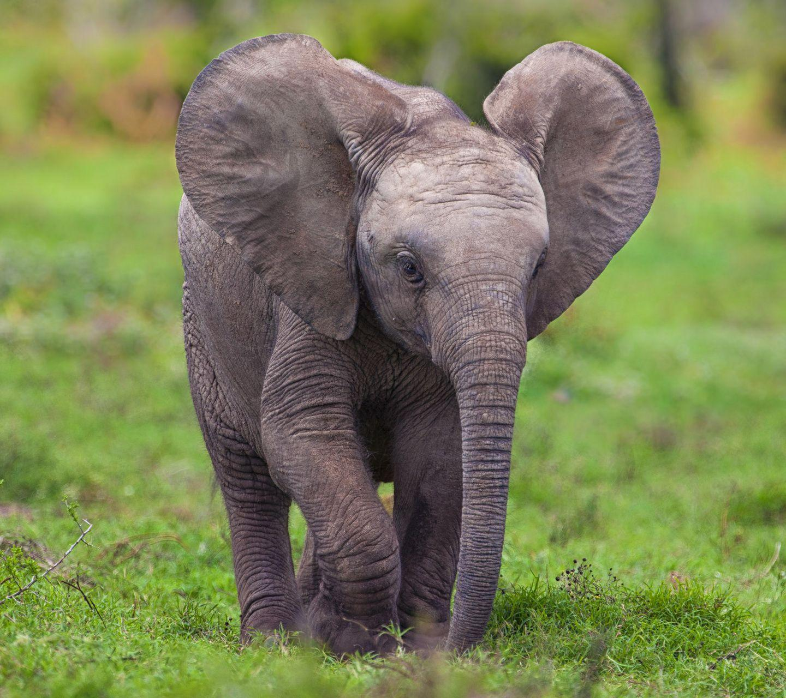
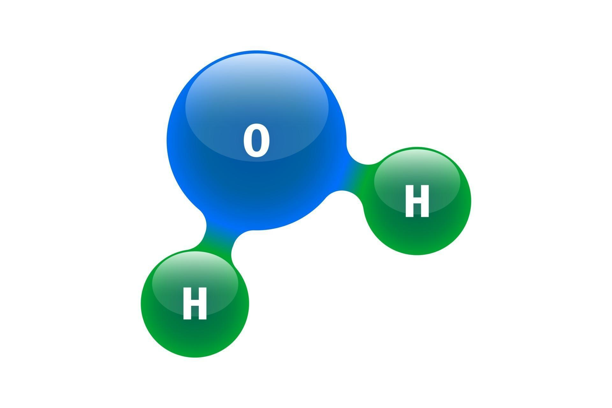

<!-- This is a sample MCQ file for demonstration purposes. Images and equations included. -->

# Question 1
Which animal is shown in the image below?

- [ ] Lion
- [x] Elephant
- [ ] Giraffe
- [ ] Tiger

---

# Question 2
What is the value of $\sqrt{16}$?

- [ ] 6
- [x] 4
- [ ] 8
- [ ] 2

Explanation: The square root of 16 is 4.

---

# Question 3
What is the result of the following equation?
$$
E = mc^2
$$

- [x] Energy-mass equivalence
- [ ] Law of gravitation
- [ ] Law of inertia
- [ ] Conservation of momentum

<!-- Source: Physics textbook, Chapter 3 -->

---

# Question 4
Identify the chemical shown in the image:

- [ ] Carbon dioxide
- [x] Water
- [ ] Oxygen
- [ ] Glucose

---

# Question 5
What is the value of $\pi$ (up to two decimal places)?

- [x] 3.14
- [ ] 2.71
- [ ] 1.62
- [ ] 3.41

---
